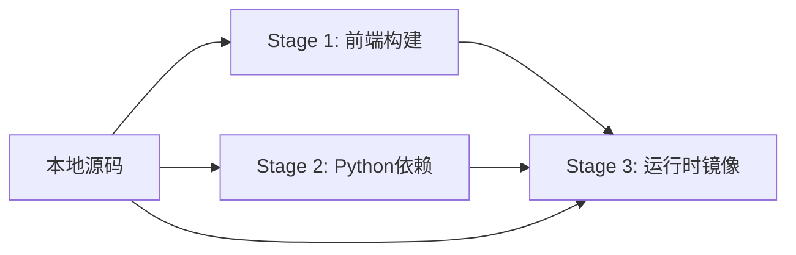

# Docker 多阶段构建优化 - 技术方案设计

## 1. 技术架构概述

本方案采用**多阶段构建（Multi-stage Build）**模式，将 Docker 镜像构建分为三个独立阶段：



### 1.1 架构优势

| 特性 | 传统方式 | 多阶段构建 |
|------|---------|-----------|
| 构建依赖 | 依赖 PyPI 发布 | 本地源码直接构建 |
| 镜像体积 | 包含构建工具 | 仅包含运行时文件 |
| 构建速度 | 每次下载完整包 | 充分利用缓存层 |
| 开发迭代 | 需要发布才能测试 | 本地即时构建测试 |
| 版本灵活性 | 受限于 PyPI 版本 | 支持任意分支/提交 |

---

## 2. 技术栈

### 2.1 基础镜像选择

#### CPU 版本
- **基础镜像**: `python:3.10-slim-bookworm`
- **理由**: 
  - Debian 12 (Bookworm) 提供更新的系统库
  - slim 变体体积小（约 120MB）
  - 官方维护，安全更新及时

#### GPU 版本
- **基础镜像**: `nvidia/cuda:11.8.0-runtime-ubuntu22.04`
- **理由**:
  - CUDA 11.8 与 PyTorch 2.1.2 兼容性最佳
  - runtime 变体不包含开发工具，体积更小
  - Ubuntu 22.04 LTS 长期支持

### 2.2 前端技术栈

- **Node.js**: 18.x LTS（Alpine 变体，体积小）
- **构建工具**: Vite 5.0
- **包管理器**: npm（项目已使用）

### 2.3 Python 依赖

- **Python**: 3.10.x
- **PyTorch**: 2.1.2
  - CPU: `torch==2.1.2 torchvision==0.16.2 --index-url https://download.pytorch.org/whl/cpu`
  - GPU: `torch==2.1.2 torchvision==0.16.2 --index-url https://download.pytorch.org/whl/cu118`
- **其他依赖**: 见 `requirements.txt`

---

## 3. Dockerfile 设计

### 3.1 CPU 版本 Dockerfile 架构

```dockerfile
# ============================================
# Stage 1: 前端构建
# ============================================
FROM node:18-alpine AS frontend-builder

WORKDIR /app/web_app

# 复制前端依赖文件（利用缓存）
COPY web_app/package*.json ./
RUN npm ci --only=production

# 复制前端源码并构建
COPY web_app/ ./
RUN npm run build

# ============================================
# Stage 2: Python 依赖安装
# ============================================
FROM python:3.10-slim-bookworm AS python-builder

WORKDIR /app

# 安装系统依赖（仅构建时需要）
RUN apt-get update && apt-get install -y --no-install-recommends \
    gcc g++ build-essential \
    && rm -rf /var/lib/apt/lists/*

# 复制并安装 Python 依赖（利用缓存）
COPY requirements.txt ./
RUN pip install --no-cache-dir --user \
    torch==2.1.2 torchvision==0.16.2 \
    --index-url https://download.pytorch.org/whl/cpu && \
    pip install --no-cache-dir --user -r requirements.txt

# ============================================
# Stage 3: 运行时镜像
# ============================================
FROM python:3.10-slim-bookworm

WORKDIR /app

# 安装运行时系统依赖
RUN apt-get update && apt-get install -y --no-install-recommends \
    libsm6 libxext6 libxrender1 libgomp1 \
    libglib2.0-0 libgl1-mesa-glx \
    ffmpeg \
    && rm -rf /var/lib/apt/lists/*

# 从构建阶段复制 Python 包
COPY --from=python-builder /root/.local /root/.local
ENV PATH=/root/.local/bin:$PATH

# 复制应用代码
COPY iopaint/ ./iopaint/
COPY main.py setup.py README.md ./

# 从前端构建阶段复制构建产物
COPY --from=frontend-builder /app/web_app/dist ./iopaint/web_app

# 安装应用（editable mode，方便调试）
RUN pip install --no-cache-dir -e .

# 暴露端口
EXPOSE 8080

# 健康检查
HEALTHCHECK --interval=30s --timeout=10s --start-period=60s --retries=3 \
    CMD python -c "import requests; requests.get('http://localhost:8080/api/v1/server-config', timeout=5)"

# 启动命令
CMD ["python", "-m", "iopaint", "start", \
     "--host", "0.0.0.0", \
     "--port", "8080", \
     "--model", "lama", \
     "--device", "cpu"]
```

### 3.2 GPU 版本 Dockerfile 差异

GPU 版本与 CPU 版本的主要差异：

1. **基础镜像**: `nvidia/cuda:11.8.0-runtime-ubuntu22.04`
2. **PyTorch 安装**:
   ```dockerfile
   RUN pip install --no-cache-dir --user \
       torch==2.1.2 torchvision==0.16.2 \
       --index-url https://download.pytorch.org/whl/cu118 && \
       pip install --no-cache-dir --user \
       xformers==0.0.23.post1 \
       --index-url https://download.pytorch.org/whl/cu118
   ```
3. **默认设备**: `--device cuda`

---

## 4. .dockerignore 设计

```gitignore
# Git 相关
.git
.gitignore
.gitattributes

# Python 相关
__pycache__
*.py[cod]
*$py.class
*.so
.Python
venv/
env/
ENV/
.venv
pip-log.txt
pip-delete-this-directory.txt
.pytest_cache/
.coverage
htmlcov/
*.egg-info/
dist/
build/

# Node.js 相关
node_modules/
npm-debug.log*
yarn-debug.log*
yarn-error.log*
.npm
.yarn

# 前端构建产物（会在 Docker 内重新构建）
web_app/dist/
web_app/.vite/

# IDE 相关
.vscode/
.idea/
*.swp
*.swo
*~
.DS_Store

# 文档和示例
docs/
specs/
assets/
*.md
!README.md

# 测试相关
iopaint/tests/
*.test.js
*.spec.js

# 其他
tmp/
temp/
*.log
.env.local
.env.*.local
```

---

## 5. 构建脚本设计

### 5.1 build_docker_multistage.sh

```bash
#!/usr/bin/env bash
set -e

# 颜色输出
RED='\033[0;31m'
GREEN='\033[0;32m'
YELLOW='\033[1;33m'
NC='\033[0m' # No Color

# 默认参数
VERSION=${VERSION:-"latest"}
BUILD_TYPE=${1:-"all"}  # all, cpu, gpu
PUSH=${PUSH:-false}
REGISTRY=${REGISTRY:-""}

# 镜像名称
IMAGE_NAME="iopaint"
if [ -n "$REGISTRY" ]; then
    IMAGE_NAME="${REGISTRY}/${IMAGE_NAME}"
fi

# 打印信息
print_info() {
    echo -e "${GREEN}[INFO]${NC} $1"
}

print_warn() {
    echo -e "${YELLOW}[WARN]${NC} $1"
}

print_error() {
    echo -e "${RED}[ERROR]${NC} $1"
}

# 构建函数
build_image() {
    local type=$1
    local dockerfile="docker/${type}Dockerfile.multistage"
    local tag="${IMAGE_NAME}:${type}-${VERSION}"
    
    print_info "Building ${type} image: ${tag}"
    
    docker buildx build \
        --platform linux/amd64 \
        --file "${dockerfile}" \
        --tag "${tag}" \
        --build-arg VERSION="${VERSION}" \
        --label org.opencontainers.image.title="IOPaint" \
        --label org.opencontainers.image.description="Image inpainting tool powered by SOTA AI Model" \
        --label org.opencontainers.image.url="https://github.com/Sanster/IOPaint" \
        --label org.opencontainers.image.source="https://github.com/Sanster/IOPaint" \
        --label org.opencontainers.image.version="${VERSION}" \
        --label org.opencontainers.image.created="$(date -u +'%Y-%m-%dT%H:%M:%SZ')" \
        .
    
    if [ $? -eq 0 ]; then
        print_info "✓ Successfully built ${tag}"
        
        # 显示镜像信息
        docker images "${IMAGE_NAME}" | grep "${type}-${VERSION}"
        
        # 推送镜像（如果需要）
        if [ "$PUSH" = true ]; then
            print_info "Pushing ${tag} to registry..."
            docker push "${tag}"
        fi
    else
        print_error "✗ Failed to build ${tag}"
        exit 1
    fi
}

# 主逻辑
print_info "IOPaint Docker Multi-stage Build Script"
print_info "Version: ${VERSION}"
print_info "Build Type: ${BUILD_TYPE}"

case "$BUILD_TYPE" in
    cpu)
        build_image "cpu"
        ;;
    gpu)
        build_image "gpu"
        ;;
    all)
        build_image "cpu"
        build_image "gpu"
        ;;
    *)
        print_error "Invalid build type: ${BUILD_TYPE}"
        print_info "Usage: $0 [cpu|gpu|all]"
        exit 1
        ;;
esac

print_info "Build completed successfully!"
```

---

## 6. 数据库设计

本功能不涉及数据库设计。

---

## 7. 接口设计

### 7.1 环境变量接口

容器支持以下环境变量配置：

| 环境变量 | 默认值 | 说明 |
|---------|--------|------|
| `MODEL` | `lama` | 默认使用的模型 |
| `DEVICE` | `cpu`/`cuda` | 计算设备 |
| `HOST` | `0.0.0.0` | 监听地址 |
| `PORT` | `8080` | 监听端口 |
| `MODEL_DIR` | `/app/models` | 模型存储目录 |
| `OUTPUT_DIR` | `/app/outputs` | 输出目录 |

### 7.2 数据卷挂载

推荐挂载以下目录：

```bash
docker run -p 8080:8080 \
  -v $(pwd)/models:/app/models \
  -v $(pwd)/outputs:/app/outputs \
  iopaint:cpu-latest
```

---

## 8. 测试策略

### 8.1 构建测试

1. **缓存测试**: 验证修改不同文件时的缓存效果
2. **体积测试**: 验证镜像大小是否符合预期
3. **多平台测试**: 验证 linux/amd64 和 linux/arm64 构建

### 8.2 功能测试

1. **启动测试**: 验证容器能否正常启动
2. **Web UI 测试**: 验证前端资源是否正确加载
3. **模型推理测试**: 验证 inpainting 功能是否正常
4. **插件测试**: 验证各插件是否可用

### 8.3 性能测试

1. **构建速度**: 首次构建和缓存构建的时间
2. **启动速度**: 容器启动到服务可用的时间
3. **推理速度**: CPU/GPU 推理性能对比

---

## 9. 安全性设计

### 9.1 镜像安全

1. **最小化原则**: 仅安装必需的依赖
2. **固定版本**: 所有依赖使用固定版本号
3. **定期更新**: 定期更新基础镜像和依赖

### 9.2 运行时安全

1. **非 root 用户**（可选）:
   ```dockerfile
   RUN useradd -m -u 1000 iopaint
   USER iopaint
   ```

2. **只读文件系统**（可选）:
   ```bash
   docker run --read-only \
     -v /tmp \
     -v /app/models \
     iopaint:cpu-latest
   ```

---

## 10. 部署方案

### 10.1 Docker Compose 配置

```yaml
version: '3.8'

services:
  iopaint-cpu:
    image: iopaint:cpu-latest
    ports:
      - "8080:8080"
    volumes:
      - ./models:/app/models
      - ./outputs:/app/outputs
    environment:
      - MODEL=lama
      - DEVICE=cpu
    restart: unless-stopped

  iopaint-gpu:
    image: iopaint:gpu-latest
    ports:
      - "8081:8080"
    volumes:
      - ./models:/app/models
      - ./outputs:/app/outputs
    environment:
      - MODEL=lama
      - DEVICE=cuda
    deploy:
      resources:
        reservations:
          devices:
            - driver: nvidia
              count: 1
              capabilities: [gpu]
    restart: unless-stopped
```

### 10.2 Kubernetes 部署（可选）

```yaml
apiVersion: apps/v1
kind: Deployment
metadata:
  name: iopaint
spec:
  replicas: 1
  selector:
    matchLabels:
      app: iopaint
  template:
    metadata:
      labels:
        app: iopaint
    spec:
      containers:
      - name: iopaint
        image: iopaint:cpu-latest
        ports:
        - containerPort: 8080
        env:
        - name: MODEL
          value: "lama"
        - name: DEVICE
          value: "cpu"
        volumeMounts:
        - name: models
          mountPath: /app/models
        - name: outputs
          mountPath: /app/outputs
      volumes:
      - name: models
        persistentVolumeClaim:
          claimName: iopaint-models
      - name: outputs
        persistentVolumeClaim:
          claimName: iopaint-outputs
```

---

## 11. 性能优化

### 11.1 构建优化

1. **层级顺序优化**: 将变化频率低的层放在前面
2. **并行构建**: 使用 BuildKit 的并行构建特性
3. **缓存策略**: 合理使用 `--cache-from` 和 `--cache-to`

### 11.2 运行时优化

1. **模型预加载**: 可选择在构建时预下载常用模型
2. **内存优化**: 使用 `--low-mem` 参数减少内存占用
3. **GPU 优化**: 使用 `--no-half` 控制精度

---

## 12. 监控与日志

### 12.1 健康检查

```dockerfile
HEALTHCHECK --interval=30s --timeout=10s --start-period=60s --retries=3 \
    CMD python -c "import requests; requests.get('http://localhost:8080/api/v1/server-config', timeout=5)"
```

### 12.2 日志输出

容器日志输出到 stdout/stderr，可通过以下方式查看：

```bash
# 查看实时日志
docker logs -f <container_id>

# 查看最近 100 行日志
docker logs --tail 100 <container_id>
```

---

## 13. 向后兼容性

### 13.1 兼容性保证

1. **命令行参数**: 保持与旧版本完全一致
2. **环境变量**: 新增环境变量，不删除旧的
3. **数据卷路径**: 保持与旧版本一致
4. **端口映射**: 默认端口保持 8080

### 13.2 迁移指南

从旧版本迁移到新版本：

```bash
# 1. 停止旧容器
docker stop old-iopaint

# 2. 使用相同的配置启动新容器
docker run -p 8080:8080 \
  -v $(pwd)/models:/app/models \
  iopaint:cpu-latest
```

---

## 14. 文档更新计划

1. **README.md**: 更新 Docker 使用说明
2. **docs/docker.md**: 创建详细的 Docker 文档
3. **CHANGELOG.md**: 记录 Docker 构建方式的变更

---

## 15. 实施时间表

| 阶段 | 任务 | 预计时间 |
|------|------|---------|
| 1 | 编写 CPU Dockerfile | 2 小时 |
| 2 | 编写 GPU Dockerfile | 1 小时 |
| 3 | 编写 .dockerignore | 0.5 小时 |
| 4 | 编写构建脚本 | 2 小时 |
| 5 | 本地测试验证 | 3 小时 |
| 6 | 文档编写 | 2 小时 |
| 7 | CI/CD 集成 | 2 小时 |
| **总计** | | **12.5 小时** |

